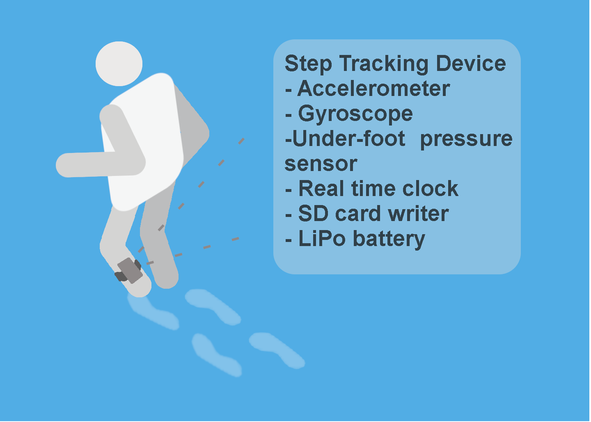
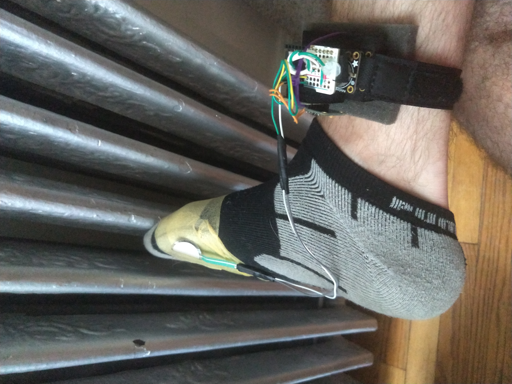
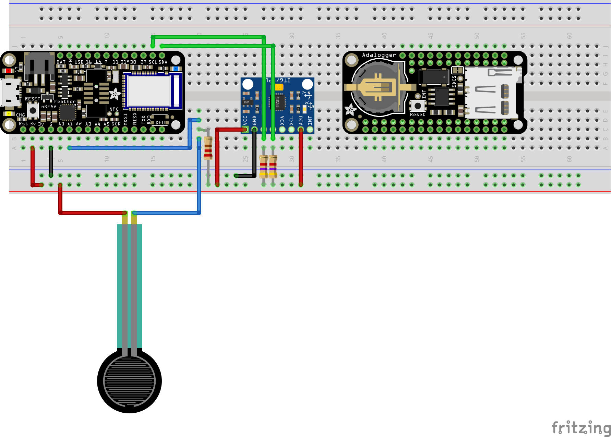
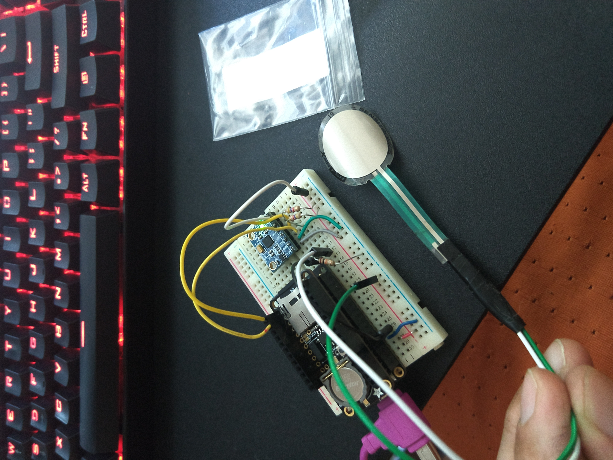
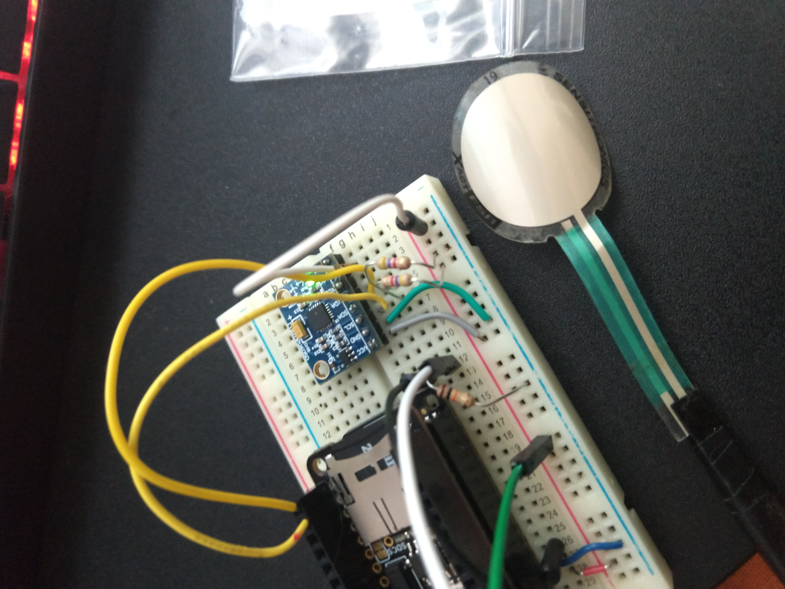
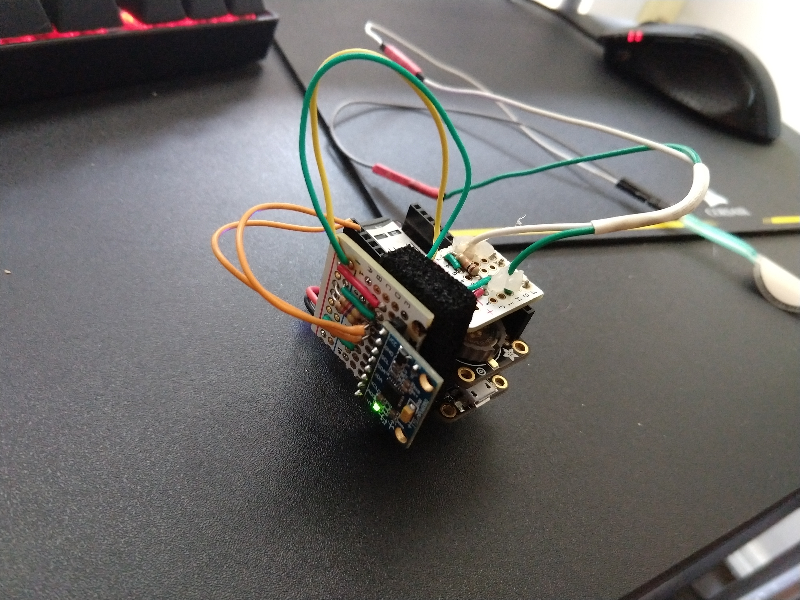
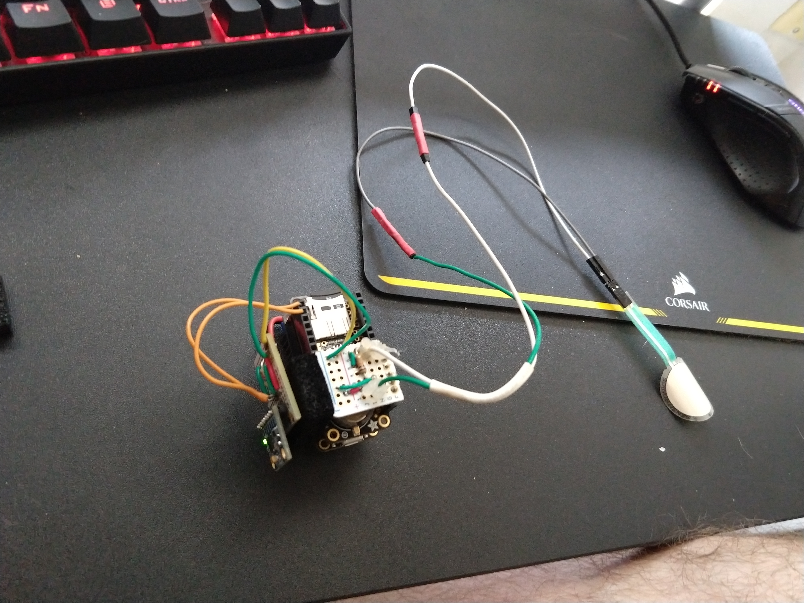
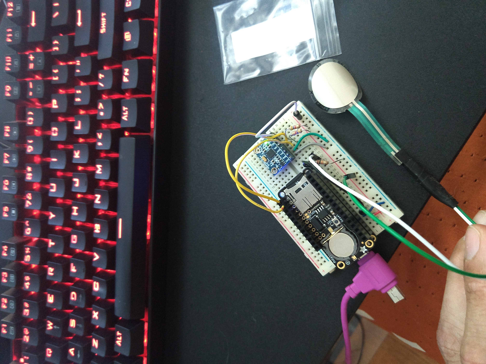

#  S.S.T.
## Simple Step Tracking

A rapid prototyple to allow step tracking at foot level. Use case is to validate step tracking algorithms for wrist worns or other biomechanical devices. The device is wore around the ankle. The two main sensors are the force sensitive resistor (FSR) and an accelerometer/gyroscope module. The readings from these sensors are output to an SD card located on the device. Device is powered with a LiPo battery.



## Project overview
### Required for project 
#### Hardware
- [Adafruit Feather NRF52](https://learn.adafruit.com/bluefruit-nrf52-feather-learning-guide?view=all)
-  [AdaFruit Data Logger + RTC Feather Wing](https://www.adafruit.com/product/2922)
- [mpu6050 Accelerometer/Gyro modle](https://store.invensense.com/datasheets/invensense/MPU-6050_DataSheet_V3%204.pdf)
- [1 Small FSR](https://www.adafruit.com/product/166?gclid=Cj0KCQjwj_XpBRCCARIsAItJiuTcrXpMGNeuTHYRj1z0Lm8RHtkYdx6qYQlsoPKe9_s6JMVDyEAw94IaAk0qEALw_wcB)
- 2 GB Micro SD Card

### Aims of Project
- Goal of the project is to create an accurate step counter. 
- The raw readings from the sensors are outputted to an SD card
- Days of recording in a small footprint to be worn

### Usage
- Make sure SD card is inserted before power up. 
- Writes to file DATALOG.txt
- If runs out of power last few write timestamps will show incorrect.
- Unplug SD to charge
- Make sure powered down to reinsert SD
- Then reconnect battery

> sample stepping data located in the [sample log](SampleLogs/Steps21.txt)




#### Assembly


<body>
<h1>Bill of Materials: SimpleStepTracking.fzz</h1>
<p class="meta">Monday, July 29 2019, 16:35:48</p>
<h2>Assembly List</h2>
<table>

  <thead>
   <tr>
    <th>Label</th>
    <th>Part Type</th>
    <th>Properties</th>
    </tr>
  </thead>
  <tbody>
  <tr>
    <td>J1</td>
    <td>Basic Force Sensing Resistor (FSR)</td>
    <td class="props">package THT; sensing area diameter .5 "</td>
</tr><tr>
    <td>Part1</td>
    <td>Adafruit Feather nRF52</td>
    <td class="props">variant variant 1; part # Adafruit #3406</td>
</tr><tr>
    <td>Part2</td>
    <td>Adafruit Adalogger FeatherWing</td>
    <td class="props">variant variant 1; part # Adafruit #2922</td>
</tr><tr>
    <td>Part3</td>
    <td>InvenSense MPU6050</td>
    <td class="props">variant MPU-6050; pins 8</td>
</tr><tr>
    <td>R1</td>
    <td>220Ω Resistor</td>
    <td class="props">tolerance ±5%; package THT; bands 4; pin spacing 400 mil; resistance 220Ω</td>
</tr><tr>
    <td>R2</td>
    <td>4.7kΩ Resistor</td>
    <td class="props">tolerance ±5%; package 2512 [SMD]; resistance 4.7kΩ</td>
</tr><tr>
    <td>R3</td>
    <td>4.7kΩ Resistor</td>
    <td class="props">tolerance ±5%; package 2512 [SMD]; resistance 4.7kΩ</td>
</tr>
  </tbody>
</table>
<h2>Shopping List</h2>
<table>
  <thead>
	<tr>
    <th>Amount</th>
    <th>Part Type</th>
    <th>Properties</th>
    </tr>
  </thead>
  <tbody>
<tr>
    <td>1</td>
    <td>Basic Force Sensing Resistor (FSR)</td>
    <td class="props">package THT; sensing area diameter .5 "</td>
</tr><tr>
    <td>1</td>
    <td>Adafruit Feather nRF52</td>
    <td class="props">variant variant 1; part # Adafruit #3406</td>
</tr><tr>
    <td>1</td>
    <td>Adafruit Adalogger FeatherWing</td>
    <td class="props">variant variant 1; part # Adafruit #2922</td>
</tr><tr>
    <td>1</td>
    <td>InvenSense MPU6050</td>
    <td class="props">variant MPU-6050; pins 8</td>
</tr><tr>
    <td>1</td>
    <td>220Ω Resistor</td>
    <td class="props">tolerance ±5%; package THT; bands 4; pin spacing 400 mil; resistance 220Ω</td>
</tr><tr>
    <td>2</td>
    <td>4.7kΩ Resistor</td>
    <td class="props">tolerance ±5%; package 2512 [SMD]; resistance 4.7kΩ</td>
</tr>
  </tbody>
</table>
</body>
</html>

Notice correct pull-up resistors on i2c connectiong from mpu module. i2c coms from the mpu6050 is addressed high, module AD0 pin is connect to possitive with a referince in firmware. Voltage divider on FSR.

#### Output
Unix Times stamp, ax, ay, az, gx, gy, gz, force
```
1564329544,-816,16584,1672,-214,-350,880,0
1564329544,-648,16960,1540,935,1261,-216,0
1564329544,-832,14980,-168,752,1540,435,0
1564329544,-1304,14308,5164,1640,-1731,1915,0
```

#### Current Build











