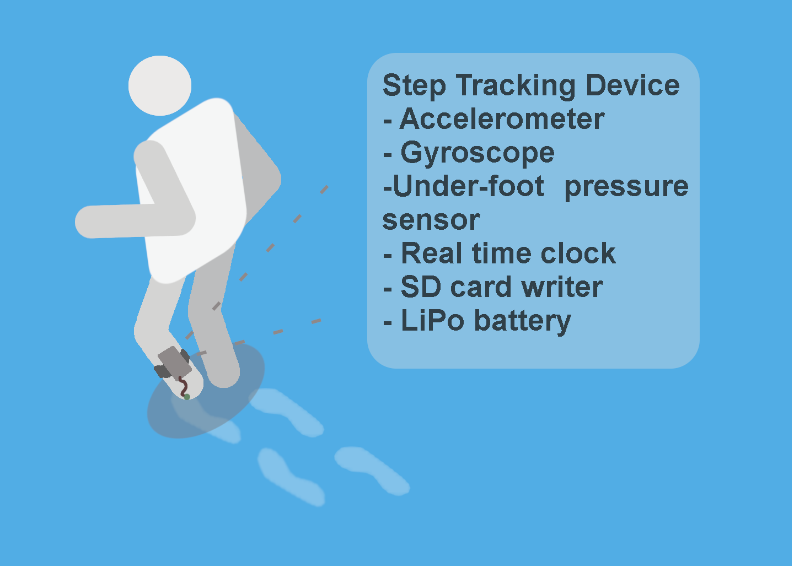

#  S.S.T.
## Simple Step Tracking

A rapid prototyple to allow step tracking at foot level. Use case is to validate step tracking algorithms for wrist worns or other biomechanical devices. The device is wore around the ankle. The two main sensors are the force sensitive resistor (FSR) and an accelerometer/gyroscope module. The readings from these sensors are output to an SD card located on the device. Device is powered with a LiPo battery.



## Project overview
### Required for project 
#### Hardware
- [Adafruit Feather NRF52](https://learn.adafruit.com/bluefruit-nrf52-feather-learning-guide?view=all)
-  [AdaFruit Data Logger + RTC Feather Wing](https://www.adafruit.com/product/2922)
- [mpu6050 Accelerometer/Gyro modle](https://store.invensense.com/datasheets/invensense/MPU-6050_DataSheet_V3%204.pdf)
- [1 Small FSR](https://www.adafruit.com/product/166?gclid=Cj0KCQjwj_XpBRCCARIsAItJiuTcrXpMGNeuTHYRj1z0Lm8RHtkYdx6qYQlsoPKe9_s6JMVDyEAw94IaAk0qEALw_wcB)
- 2 GB Micro SD Card

### Aims of Project
- Goal of the project is to create an accurate step counter. 
- The raw readings from the sensors are outputted to an SD card
- Days of recording in a small footprint to be worn


#### Assembly
[Fritzing sketch]

Notice correct pull-up and down resistors. i2c coms from the mpu6050 is addressed high, module AD0 pin is connect to possitive with a referince in firmware.

#### Output
Unix Times stamp, ax, ay, az, gx, gy, gz, force
```
1564329544,-816,16584,1672,-214,-350,880,0
1564329544,-648,16960,1540,935,1261,-216,0
1564329544,-832,14980,-168,752,1540,435,0
1564329544,-1304,14308,5164,1640,-1731,1915,0
```

#### Current Build


